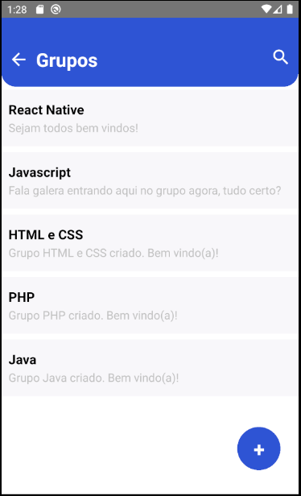
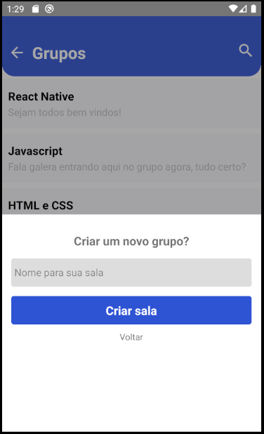
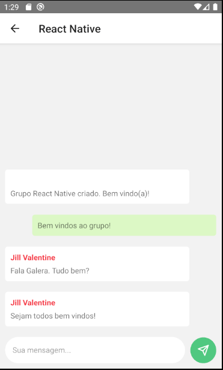

  <h1>Chat</h1>

  
  
  

Aplicativo de mensagens realtime construido com React Native e Firebase

## ✔️ Técnicas e tecnologias utilizadas

Lista de tecnologias que foram usadas nesse projeto:

### 📚 Outras bibliotecas utilizadas

- [React Navigation](https://reactnavigation.org/)
- [Vector Icons](https://github.com/oblador/react-native-vector-icons)

## 🛠️ Abrir e rodar o projeto

Para abrir e rodar o projeto, entre na pasta do projeto e execute `npm install` para instalar as dependências e `npx react-native run-android` para iniciar o projeto.

## 📚 Mais informações

Entre em contato pelo [linkedin](https://www.linkedin.com/in/grazziano-fagundes/).

  <small>Grazziano Borges Fagundes - 2023</small>

